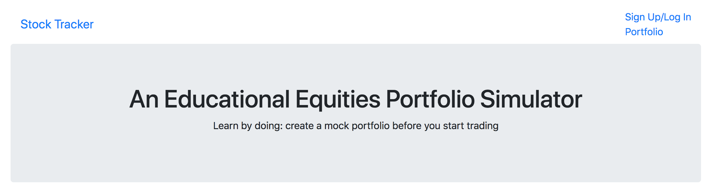
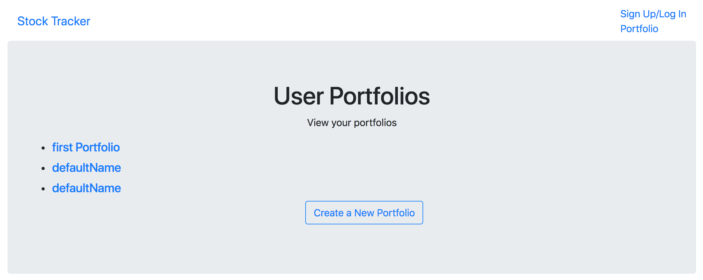

# Stock Tracker
A web-app for users to create small simulated portfolios using real-time equities data using the MEAN stack (MongoDB, Express.js, Angular.js and Node.js) and Bootstrap. Quotes for live equities data are pulled from the Alpha Vantage API.

## Progress
This app is a work in progress, and all work is saved in the development branch.
Current features:

Landing page

Portfolio listings for a user (RESTful)

Live data on holdings in a given portfolio from Alpha Vantage API

